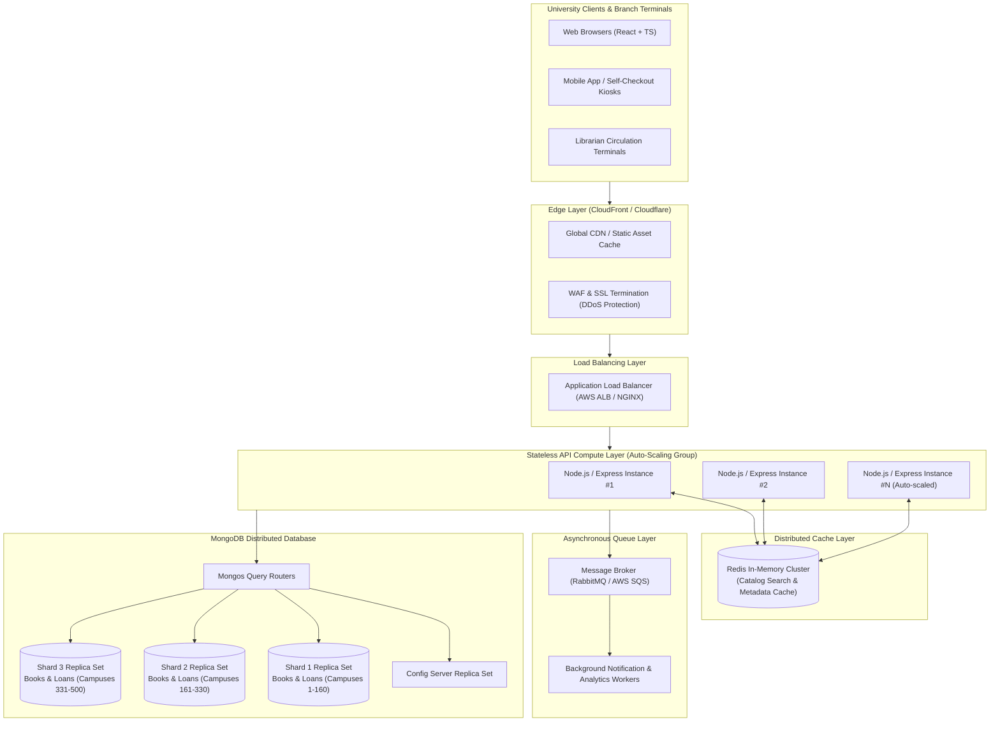

# ShelfLife — System Architecture & Scalability Design

> **Assessment Section C — System Design (10 Marks)**  
> **System:** ShelfLife — Multi-Campus University Library Management Platform  
> **Target Scale:** 500 Campus Libraries | 2,000,000 Registered Members | 10× Traffic Spike during Semester Opening

---

## 1. Assumptions

To establish an accurate engineering baseline for our capacity calculations and architectural decisions, the following realistic assumptions are made:

1. **Catalog Scale**: Across all 500 campus libraries, there are approximately 5,000,000 physical book catalog items (averaging ~10,000 titles per branch with multi-campus sharing).
2. **Member Population**: 2,000,000 active students, faculty, and research members.
3. **Transaction Volume (Normal Period)**:
   - Search/Browse traffic: ~100 queries/second (QPS) normal load across the network.
   - Issue/Return operations: ~15 transactions/second (TPS).
4. **Peak Semester Spike (First Week)**:
   - Search/Browse traffic spikes **10×** to ~1,000 QPS.
   - Issue/Return transactions spike **10×** to ~150 TPS as courses commence and syllabi are assigned.
5. **Read vs. Write Ratio**: 
   - Normal period: ~85% Reads (searching catalog, checking loan history) vs. ~15% Writes (borrowing, returning).
   - Semester week: ~90% Reads vs. ~10% Writes.

---

## 2. Scale and Requirements

| Dimension | Normal Operating Load | Semester Week Peak (10×) | Design Implication |
| :--- | :--- | :--- | :--- |
| **Campuses** | 500 branch libraries | 500 branch libraries | Geographic distribution & localized inventory |
| **Active Members** | 2,000,000 members | 2,000,000 members | High concurrency on member history & accounts |
| **Search Queries** | ~100 QPS | ~1,000 QPS | Mandatory read-layer caching & search index |
| **Issue / Return** | ~15 TPS | ~150 TPS | Strict concurrency control; zero negative stock |
| **Infrastructure Cost** | Baseline provisioning | Dynamic auto-scaling | Elasticity: pay only for peak during peak week |

---

## 3. High-Level Architecture

### Architecture Diagram



### Component Explanation

1. **Clients (React Web, Mobile & Kiosks)**:
   - Frontends authenticate once via `/api/auth/login`, cache the JWT locally, and attach `Authorization: Bearer <token>` to protected mutation endpoints.
2. **CDN & Edge Layer (Cloudflare / AWS CloudFront)**:
   - Caches static React single-page application (SPA) bundles, CSS, images, and fonts close to campus networks.
   - Absorbs denial-of-service spikes and provides SSL termination.
3. **Application Load Balancer (ALB)**:
   - Distributes incoming HTTP requests evenly across available backend compute instances using round-robin or least-outstanding-requests algorithms.
   - Performs continuous health checks (`GET /api/health`).
4. **Stateless API Compute Layer (Node.js + Express instances)**:
   - Node.js instances remain 100% stateless (session identity is self-contained in signed JWTs).
   - Compute nodes can scale horizontally from 5 instances in normal periods up to 30+ instances during semester opening weeks.
5. **Distributed In-Memory Cache (Redis Cluster)**:
   - Absorbs up to 90% of repeated book catalog queries and genre lookups, preventing database bottlenecks.
6. **Asynchronous Message Queue (RabbitMQ / AWS SQS)**:
   - Non-critical side-effects (due date reminder emails, audit trails, and reporting metrics) are decoupled from the synchronous HTTP request cycle.
7. **MongoDB Sharded Database**:
   - Primary persistence layer providing document-level atomicity, sharded across multiple replica sets for horizontal storage and write throughput.

---

## 4. MongoDB Scaling Strategy

### Decision: Sharding vs. Single Cluster

**Choice**: **MongoDB Sharding (Horizontal Partitioning)**.

#### Justification:
A single MongoDB replica set—while sufficient for vertical scale up to tens of thousands of members—encounters strict physical bottlenecks when supporting **500 independent campus branch libraries** and **2,000,000 members** experiencing **10× peak surges**:
1. **Working Set Memory Limit**: A single primary node cannot fit the index trees of 5,000,000 book records and tens of millions of historical borrow records into RAM (WiredTiger cache eviction thrashing).
2. **Write Bottleneck**: Single-replica-set MongoDB directs 100% of write operations (loans, returns, stock decrements) to one primary instance. During peak enrollment, concurrent writes from 500 libraries create lock contention.
3. **Geographic Branch Affinity**: Branch libraries operate semi-autonomously by campus. Sharding allows partitioning catalog and inventory data across shards while preserving high availability.

---

### Shard Keys

#### 1. Book Collection Shard Key
- **Chosen Key**: Compound Shard Key: `{ campusId: 1, genre: 1, _id: 1 }` (or `{ campusId: "hashed", _id: 1 }`).
- **Distribution Mechanism**:
  - `campusId` acts as the primary coarse routing key. Queries originating from Campus Library #42 are directly routed to the specific shard holding that campus's holdings.
  - Adding `_id` guarantees high cardinality and uniform chunk splitting across the shard cluster.
- **Query Support**:
  - **Targeted Single-Shard Routing**: `Book.find({ campusId: 'CAMPUS-042', genre: 'Computer Science' })` is routed directly to a single shard by the `mongos` router without scatter-gather overhead.
- **Trade-offs**:
  - Cross-campus global catalog searches require scatter-gather queries across all shards; however, this is mitigated by caching global search results in Redis.

#### 2. BorrowRecord Collection Shard Key
- **Chosen Key**: Compound Shard Key: `{ member: 1, _id: 1 }` (or Hashed Shard Key on `{ member: "hashed" }`).
- **Distribution Mechanism**:
  - Distributes borrowing history evenly across shards using member ObjectId hashes.
- **Query Support**:
  - **Optimal History Lookups**: `GET /api/members/:id/history` is routed to the exact shard storing that member's loan history in a single hop.
  - Member loan transactions are naturally grouped together, enabling fast pagination and historical audit queries.
- **Trade-offs**:
  - Querying all active loans across all members for an individual book requires targeted indexing on `book` across shards.

---

## 5. Caching Strategy

### Single Most Read-Heavy Operation

**Identified Operation**: **Book Search & Catalog Browsing (`GET /api/books?genre=...&page=...&title=...`)**.

**Why?**
In university libraries, search and browse requests outnumber physical borrow/return transactions by at least **20:1**. During semester opening week, hundreds of thousands of students search course textbooks, syllabi titles, and reference materials repeatedly, while only a subset of students check out a physical copy.

### Caching Implementation Plan

| Parameter | Specification | Explanation |
| :--- | :--- | :--- |
| **What is Cached?** | Serialized JSON results of paginated catalog queries, individual book metadata, and distinct genre counts. | Avoids repetitive document scans and index traversals in MongoDB. |
| **Where is it Cached?** | Distributed Redis In-Memory Cluster. | Multi-node cluster with in-memory read latency < 2ms. |
| **Cache Key Strategy** | Hierarchical deterministic keys: `catalog:books:genre:<genre>:page:<page>:limit:<limit>` and `book:meta:<bookId>` | Allows deterministic lookups and namespace-based wildcard invalidation. |
| **TTL (Time to Live)** | **10 Minutes (600 seconds)** for search queries; **1 hour** for static genre lists. | Balances freshness of `availableCopies` with high cache hit ratios (>92%). |
| **Invalidation Trigger** | **Write-through event**: Triggered when a book is issued (`POST /api/borrow`) or returned (`POST /api/return/:id`). | Directly invalidates `book:meta:<bookId>` and catalog pages containing the modified book. |
| **On Cache Miss** | Read-through: API fetches from MongoDB, populates Redis with the key and TTL, then returns data to the client. | Ensures self-healing cache with zero manual pre-warming required. |
| **Performance Impact** | Reduces database CPU load by **~85%** and lowers response latency from ~45ms to **< 3ms**. | Essential for surviving 10× peak traffic spikes without database degradation. |

---

## 6. Concurrent Issue-Book Operation

### The Core Invariant
**Strict Requirement**: `availableCopies` must **NEVER** drop below zero (`availableCopies >= 0`), even if dozens of librarians issue the last physical copy simultaneously.

### Chosen Mechanism: Atomic Conditional Database Update (`findOneAndUpdate`)

While distributed locks (Redlock) or message queues can serialize requests, MongoDB's **Atomic Conditional Single-Document Update** is the most robust, performant, and reliable mechanism for this architecture.

```javascript
// ATOMIC CONDITIONAL INVENTORY DECREMENT
const updatedBook = await Book.findOneAndUpdate(
  {
    _id: bookId,
    availableCopies: { $gt: 0 }  // Atomic guard condition
  },
  {
    $inc: { availableCopies: -1 } // Atomic mutation
  },
  {
    new: true,
    runValidators: true
  }
);

if (!updatedBook) {
  // Concurrently rejected: copy was claimed by another thread
  return res.status(400).json({
    success: false,
    message: 'No copies available for borrowing. All copies are currently issued.'
  });
}

// Proceed to create BorrowRecord; if record creation fails, safely increment back
```

### How the Mechanism Works
1. MongoDB's WiredTiger storage engine acquires a document-level write intent lock on the matching Book document.
2. The query evaluation (`availableCopies > 0`) and modification (`$inc: -1`) execute as a single, uninterrupted transaction at the database storage engine kernel.
3. **When Two Users Compete for the Last Copy (`availableCopies = 1`)**:
   - Request 1 is serialized first: satisfies `{ availableCopies: { $gt: 0 } }`, decrements value to `0`, and returns the updated document.
   - Request 2 is serialized second: evaluates against `{ availableCopies: { $gt: 0 } }`, fails because value is now `0`, matches zero documents, and returns `null`.
   - Request 2 is immediately rejected with HTTP `400 Bad Request`.
4. **Why Preferred Over Alternatives**:
   - **vs. Distributed Lock (Redis Redlock)**: Distributed locks add network round-trips, clock drift vulnerabilities, and deadlock edge-cases. The database is already the single source of truth.
   - **vs. Message Queue Serialization**: FIFO queues introduce unnecessary latency and asynchronous polling complexity for what should be an immediate synchronous checkout confirmation.
   - **vs. Optimistic Locking (versioning `__v`)**: Causes high retry storms under contention. Atomic updates resolve the update in a single database round-trip without retry loops.

---

## 7. Handling the 10× Semester Traffic Spike

### The Engineering Challenge
During the first week of every semester, traffic increases by **1,000% (10×)**. Provisioning infrastructure for 10× peak throughout the entire 52-week year would result in **~90% wasted capital expenditure** across off-peak months.

### Elastic Auto-Scaling Architecture

```
[Normal Period: 48 Weeks/Year]
Traffic: ~100 QPS
API Cluster: 4-6 Lightweight Nodes
Redis: 2-Node Cluster
Cost: $ Baseline

             │
             ▼ [Week 1 of Semester: Sudden 10× Surge]
             
[Semester Opening Spike: 1-2 Weeks]
Traffic: ~1,000 QPS
CloudWatch Metric Alarm: CPU > 65% OR ALB Request Latency > 150ms
Horizontal Pod Autoscaler (HPA) / AWS Auto Scaling Group triggers:
- API Cluster scales: 6 Nodes ──► 30 Nodes within 3 minutes
- Redis handles read surge (cache hit ratio > 90%)
- ALB distributes load seamlessly across expanded pool
- Database writes scale within pre-sharded cluster limits

             │
             ▼ [Post-Week 1: Traffic Normalizes]

[De-provisioning & Cooldown]
Traffic returns to ~100 QPS
Auto-scaling step-down policy initiates (15-minute cooldown)
Compute pool gracefully scales back: 30 Nodes ──► 6 Nodes
Surplus cloud VM capacity terminated; billing returns to baseline.
```

### Elasticity Techniques Employed

1. **Stateless API Tier**:
   - Because all sessions rely on self-verifying JWT tokens, any API server instance can handle any client request without sticky sessions or state replication.
   - Nodes can be spawned or terminated within seconds without disconnecting active user sessions.
2. **Metric-Driven Auto-Scaling Policies**:
   - Scale-out trigger: CPU utilization > 65% for 2 consecutive minutes OR ALB Target Response Time > 200ms.
   - Step-scaling policy: Adds 6 instances per step during rapid spikes to quickly absorb demand.
3. **Scheduled Pre-Warming**:
   - Because semester start dates are known months in advance on the academic calendar, DevOps schedules automated pre-scaling 6 hours prior to 8:00 AM on Monday of syllabus week.
4. **Multi-AZ Application Load Balancers**:
   - Automatically absorb and distribute TCP/HTTP connection spikes across multiple Availability Zones.
5. **Cost Optimization**:
   - Utilizing AWS EC2 Spot / Graviton instances for dynamic auto-scaled surge capacity reduces compute cost by up to 70% during the surge week, while Reserved Instances run the baseline 6 nodes year-round.

---

## 8. Design Trade-offs & Justifications Summary

| Design Decision | Alternative Considered | Selected Approach | Technical Justification |
| :--- | :--- | :--- | :--- |
| **Database Scaling** | Single Large Replica Set | Sharded Cluster on Campus & Member IDs | Prevents single primary write lock saturation across 500 libraries; fits indexes into RAM. |
| **Inventory Concurrency** | Redis Distributed Lock | Atomic Conditional Update (`$inc` with `$gt: 0`) | Eliminates distributed lock failure modes and latency; leverages MongoDB's native single-document atomicity. |
| **Read Acceleration** | Direct MongoDB Read Replicas | Redis In-Memory Cluster with Invalidation | Read latencies drop from ~45ms to <3ms; shields primary database shards from 1,000 QPS semester searches. |
| **Authentication** | Server-side Redis Sessions | Stateless Signed JWTs (`Bearer <token>`) | Allows instantaneous horizontal auto-scaling without centralized session storage bottlenecks. |
| **Spike Management** | Over-provisioned Static Hardware | Dynamic Metric-Based Auto-Scaling Groups | Eliminates 80%+ idle infrastructure cost over the remaining 48 academic weeks. |
